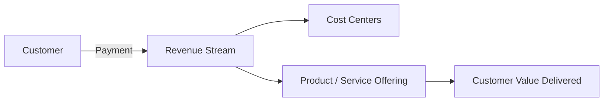

# Market & Business Analysis

## Market Overview
- Target customers:
- Market size (TAM/SAM/SOM):
- Competitive alternatives:

## Demand Signals
- Observable actions that prove demand (searches, communities, RFPs):
- Growth trends:
- Competitive benchmarks:

## Money Flow Diagram (Mermaid)

- Pricing / monetisation notes:
- Key assumptions to validate:

## Business Analysis
- Acquisition channels:
- Conversion funnel summary:
- Gross margin drivers:

## Instrumentation Plan
- Metrics to capture (with owner + cadence):
- Data sources or dashboards:
- Risks and next experiments:

_Last updated: YYYY-MM-DD_
