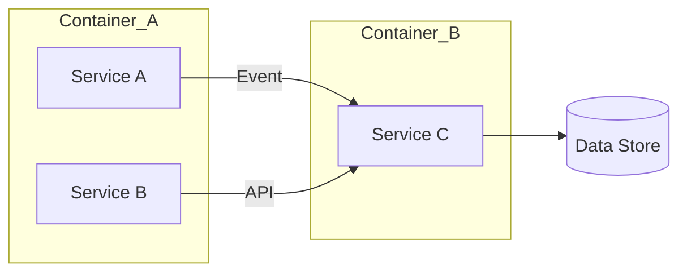

# Product Requirements Document (Money & Data Focus)

## Opportunity
- Customer problem:
- Business impact:
- Success metric:

## Money Flow Summary
- Revenue sources:
- Cost structure:
- Guardrails / compliance:

## Data Flow Diagram (C3 Mermaid)

- API capabilities (name, purpose, status):
- Data contracts (schemas, retention, privacy):

## Release Scope
| Capability | API Endpoint | Owner | Notes |
|------------|--------------|-------|-------|

## Implementation Notes
- Dependencies:
- Open questions:
- Rollout strategy:

_Last updated: YYYY-MM-DD_
