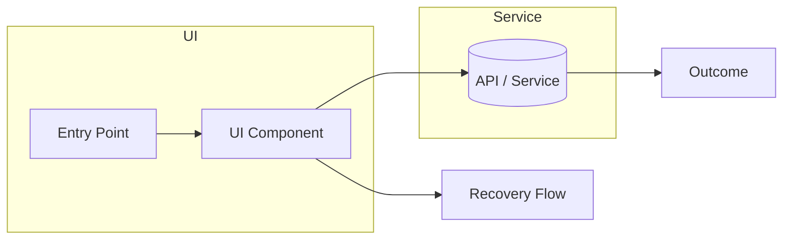

# Experience Blueprint

## Entry Points
| URL | Capability | Audience | Notes |
|-----|------------|----------|-------|

## Key User Flows (Mermaid C3)

- Success criteria:
- Error / recovery paths:

## Interface Components
| Component | Purpose | Linked Flow | Status |
|-----------|---------|-------------|--------|

## Content & States
- Copy highlights:
- Empty / loading state expectations:
- Accessibility considerations:

## Data Flow Reference
Summarise the relevant sections from `agent-artifacts/product/prd-data-flow.md` that this user flow depends on (e.g., API endpoints, events, data stores).

## Handoff Notes
- Analytics events to fire:
- Backend capability dependencies:
- Launch checklist:

_Last updated: YYYY-MM-DD_
